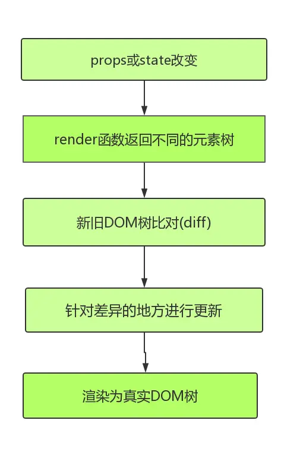

# React-cloud-music
以 React 全家桶 (包含 hooks) 以及 immutable 数据流为基础打造的一款高质量的移动端音乐类 WebApp。

## 文件目录：
```
├─api                   // 网路请求代码、工具类函数和相关配置
├─application           // 项目核心功能
├─assets                // 字体配置及全局样式
├─baseUI                // 基础 UI 轮子
├─components            // 可复用的 UI 组件
├─routes                // 路由配置文件
└─store                 //redux 相关文件
  App.js                // 根组件
  index.js              // 入口文件
  serviceWorker.js      // PWA 离线应用配置
  style.js              // 默认样式
```

## 项目技术栈：

### 前端部分：

* `react v16.8 全家桶 (react，react-router)`
* `redex`
* `redux-thunk`
* `immutable`
* `react-lazyload`
* `styled-components`
* `axios`

### 其它：
create-react-app:React脚手架，快速搭建项目
eslint:代码风格检查工具
iconfont: 阿里图标库
fastclick: 解决移动端点击延迟 300ms 的问题

### React渲染机制
Reconciliation 过程 (直译为 "协调" )



如上图，React采用的是虚拟DOM(即VDOM)。
* 当属性 (props) 和状态 (state) 发生变化的时候，render 函数返回不同的元素树
* React 会检测当前返回的元素树和上次渲染的元素树之前的差异
* 针对差异的地方进行更新操作，最后渲染为真实 DOM，这就是整个 Reconciliation 过程，
* 其核心就是进行新旧 DOM 树对比的 diff 算法。

获得更优秀的性能，首当其冲的工作便是 减少 diff 的过程